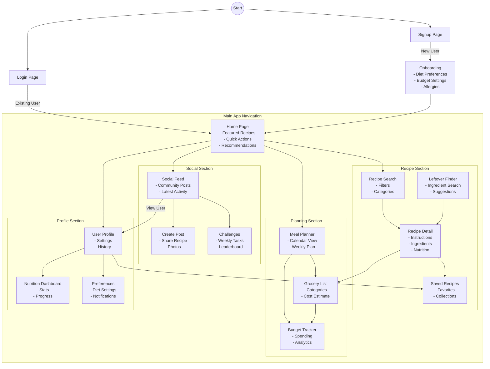

```mermaid
graph TB
Start((Start)) --> Login[Login Page]
Start --> Signup[Signup Page]

    Signup --> |New User|Onboarding[Onboarding<br/>- Diet Preferences<br/>- Budget Settings<br/>- Allergies]
    Login --> |Existing User|HomePage
    Onboarding --> HomePage

    subgraph Main["Main App Navigation"]
        HomePage[Home Page<br/>- Featured Recipes<br/>- Quick Actions<br/>- Recommendations]

        subgraph Recipe["Recipe Section"]
            RecipeSearch[Recipe Search<br/>- Filters<br/>- Categories]
            RecipeDetail[Recipe Detail<br/>- Instructions<br/>- Ingredients<br/>- Nutrition]
            SavedRecipes[Saved Recipes<br/>- Favorites<br/>- Collections]
            LeftoverFinder[Leftover Finder<br/>- Ingredient Search<br/>- Suggestions]
        end

        subgraph Plan["Planning Section"]
            MealPlanner[Meal Planner<br/>- Calendar View<br/>- Weekly Plan]
            GroceryList[Grocery List<br/>- Categories<br/>- Cost Estimate]
            BudgetTracker[Budget Tracker<br/>- Spending<br/>- Analytics]
        end

        subgraph Social["Social Section"]
            Feed[Social Feed<br/>- Community Posts<br/>- Latest Activity]
            CreatePost[Create Post<br/>- Share Recipe<br/>- Photos]
            Challenges[Challenges<br/>- Weekly Tasks<br/>- Leaderboard]
        end

        subgraph Profile["Profile Section"]
            UserProfile[User Profile<br/>- Settings<br/>- History]
            NutritionDash[Nutrition Dashboard<br/>- Stats<br/>- Progress]
            Preferences[Preferences<br/>- Diet Settings<br/>- Notifications]
        end
    end

    %% Home Connections
    HomePage --> RecipeSearch
    HomePage --> MealPlanner
    HomePage --> Feed
    HomePage --> UserProfile

    %% Recipe Connections
    RecipeSearch --> RecipeDetail
    RecipeDetail --> SavedRecipes
    RecipeDetail --> GroceryList
    LeftoverFinder --> RecipeDetail

    %% Planning Connections
    MealPlanner --> GroceryList
    MealPlanner --> BudgetTracker
    GroceryList --> BudgetTracker

    %% Social Connections
    Feed --> CreatePost
    Feed --> Challenges
    Feed --> |View User|UserProfile

    %% Profile Connections
    UserProfile --> NutritionDash
    UserProfile --> Preferences
    UserProfile --> SavedRecipes

    %% Styling
    %%classDef start fill:#f9f,stroke:#333,stroke-width:2px
    %%classDef auth fill:#e6f3ff,stroke:#4a90e2
    %%classDef main fill:#fff2e6,stroke:#ff9933
    %%classDef recipe fill:#e6ffe6,stroke:#33cc33
    %%classDef plan fill:#ffe6ff,stroke:#cc33cc
    %%classDef social fill:#ffe6e6,stroke:#ff3333
    %%classDef profile fill:#e6e6ff,stroke:#3333cc

    class Start start
    class Login,Signup,Onboarding auth
    class HomePage main
    class RecipeSearch,RecipeDetail,SavedRecipes,LeftoverFinder recipe
    class MealPlanner,GroceryList,BudgetTracker plan
    class Feed,CreatePost,Challenges social
    class UserProfile,NutritionDash,Preferences profile
```
