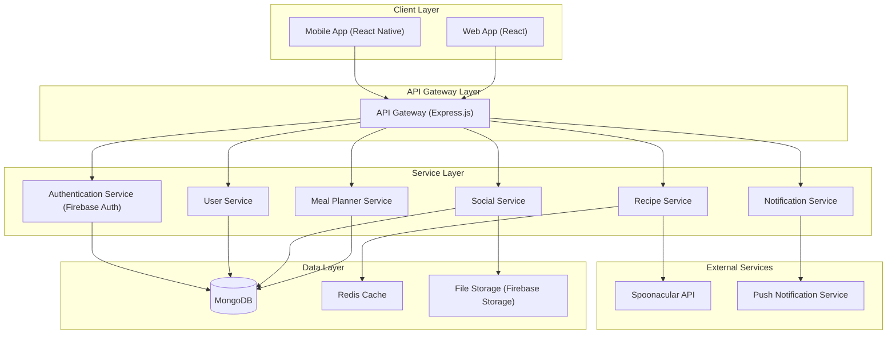

```mermaid
graph TB
subgraph "Client Layer"
    MobileApp["Mobile App (React Native)"]
    WebApp["Web App (React)"]
end

subgraph "API Gateway Layer"
    API["API Gateway (Express.js)"]
end

subgraph "Service Layer"
    AuthService["Authentication Service (Firebase Auth)"]
    RecipeService["Recipe Service"]
    UserService["User Service"]
    SocialService["Social Service"]
    PlannerService["Meal Planner Service"]
    NotifService["Notification Service"]
end

subgraph "External Services"
    SpoonAPI["Spoonacular API"]
    Push["Push Notification Service"]
end

subgraph "Data Layer"
    MongoDB[(MongoDB)]
    Cache["Redis Cache"]
    FileStore["File Storage (Firebase Storage)"]
end

MobileApp --> API
WebApp --> API

API --> AuthService
API --> RecipeService
API --> UserService
API --> SocialService
API --> PlannerService
API --> NotifService

RecipeService --> SpoonAPI
RecipeService --> Cache
NotifService --> Push

AuthService --> MongoDB
UserService --> MongoDB
SocialService --> MongoDB
PlannerService --> MongoDB

SocialService --> FileStore


%% Color styling
%%style MobileApp fill:#FFD700,stroke:#333,stroke-width:2px
%%style WebApp fill:#FFD700,stroke:#333,stroke-width:2px
%%style API fill:#FF7F50,stroke:#333,stroke-width:2px

%%style AuthService fill:#87CEEB,stroke:#333,stroke-width:2px
%%style RecipeService fill:#87CEEB,stroke:#333,stroke-width:2px
%%style UserService fill:#87CEEB,stroke:#333,stroke-width:2px
%%style SocialService fill:#87CEEB,stroke:#333,stroke-width:2px
%%tyle PlannerService fill:#87CEEB,stroke:#333,stroke-width:2px
%%style NotifService fill:#87CEEB,stroke:#333,stroke-width:2px

%%style SpoonAPI fill:#98FB98,stroke:#333,stroke-width:2px
%%style Push fill:#98FB98,stroke:#333,stroke-width:2px

%%style MongoDB fill:#DDA0DD,stroke:#333,stroke-width:2px
%%style Cache fill:#DDA0DD,stroke:#333,stroke-width:2px
%%style FileStore fill:#DDA0DD,stroke:#333,stroke-width:2px
```
